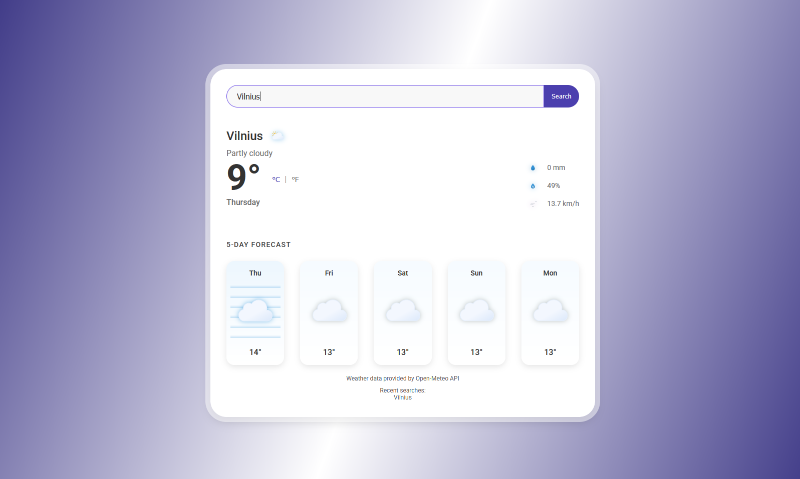

# Weather App ☀️🌧️⛅

A responsive weather application built with React, TypeScript, and Tailwind CSS that displays current weather conditions for any location.

 <!-- Add your screenshot here -->

## Features

- Real-time weather data from OpenWeatherMap API
- Search by city name
- Automatic location detection
- Displays:
  - Current temperature (with unit toggle)
  - Weather conditions (clear, rain, clouds, etc.)
  - Humidity
  - Wind speed
  - Atmospheric pressure
- Responsive design for all screen sizes
- Loading states and error handling

## Technologies Used

- React.js with TypeScript
- Tailwind CSS for styling
- Vite as build tool
- OpenWeatherMap API

## Getting Started

### Prerequisites

- Node.js (v14 or higher)
- npm or yarn
- OpenWeatherMap API key (free tier available)

### Installation

1. Clone the repository:
   ```bash
   git clone https://github.com/Daigtas/weather-app.git

    Navigate to the project directory:
    bash

cd weather-app

Install dependencies:
bash

npm install

Create a .env file in the root directory and add your OpenWeatherMap API key:
env

VITE_OPENWEATHER_API_KEY=your_api_key_here

Start the development server:
bash

    npm run dev

    Open your browser and navigate to http://localhost:5173

Available Scripts

    npm run dev: Starts the development server

    npm run build: Builds the app for production

    npm run lint: Runs ESLint

    npm run preview: Previews the production build

Contributing

Contributions are welcome! Please open an issue or submit a pull request.
License

This project is open source and available under the MIT License.
Acknowledgements

    Weather data provided by OpenWeatherMap

    Icons from Weather Icons

